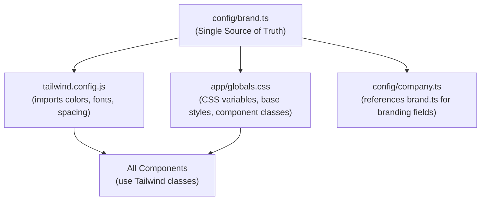

# Brand Guidelines V0 Revamp

## Architecture: Centralized Brand Config

Create a single source of truth at `[config/brand.ts](config/brand.ts)` containing every design token from the guidelines. All other files (Tailwind config, CSS, components) derive their values from this file.

---

## 1. Create `config/brand.ts` (New File)

Single centralized config exporting all design tokens from the brand guidelines:

- **Colors**: Primary (navy `#000B24`, red `#E43606`, blue `#008FB4`, gold `#DE8D06`), extended palette (off-white, grays, light variants, surfaces), semantic colors
- **Borders**: Subtle/hover/overlay opacity levels per dark mode elevation system
- **Fonts**: Space Grotesk (headings) + Inter (body) with fallback stacks
- **Type Scale**: clamp() values for H1-H3, body, caption, overline per 1.25 Major Third ratio
- **Gradients**: Hero, CTA (red-to-gold), subtle glow
- **Spacing**: Base-4 scale (4, 8, 12, 16, 24, 32, 48, 64, 96, 128px)
- **Layout**: 1280px max width, 96px/64px section padding
- **Component tokens**: Button sizes/radii, card specs, nav height, border-radius values
- **Animation**: Duration/easing presets

---

## 2. Update `tailwind.config.js`

Import tokens from `config/brand.ts` and rebuild the Tailwind theme:

- **Replace** current navy/terracotta/teal/gold/solutions palettes with brand guideline colors (navy, red, blue, gold + extended)
- **Add** surface elevation colors (surface-1, surface-2, surface-3)
- **Add** Space Grotesk + Inter font families
- **Update** max-width to 1280px (`max-w-7xl` equivalent)
- **Add** base-4 spacing scale
- **Add** border-radius tokens (16px for cards, 9999px for pills)

---

## 3. Update `app/globals.css`

- **Add** CSS custom properties (`:root` block from brand guidelines section 8.3)
- **Add** Space Grotesk `@import` via Google Fonts
- **Update** base styles: body bg to `#000B24`, `-webkit-font-smoothing: antialiased`, type scale with `clamp()`
- **Rebuild** component classes:
  - `.btn-primary`: Red-to-gold gradient, pill shape, 44px min-height, white text
  - `.btn-secondary`: Transparent bg, 1px white border at 20% opacity, pill shape
  - `.btn-outline`: Remove (replaced by `.btn-secondary`)
  - Cards, section padding, container max-width
- **Add** `prefers-reduced-motion` media query to disable animations
- **Add** dark background text rules (font-smoothing, letter-spacing adjustments)

---

## 4. Update `app/layout.tsx`

- **Add** Space Grotesk via `next/font/google` alongside Inter
- Apply both font CSS variables to the `<html>` element
- Update metadata descriptions per brand voice rules (outcome-first, no banned words)

---

## 5. Copy Logo to `public/`

- Copy `/Users/casimirdebonneval/Python Scripts/Logo-Maker/output/horizontal/bonneval-horizontal-geist-transparent.svg` to `public/logo.svg` (replacing current)
- The SVG is ~201KB with embedded Geist font and lion icon; self-contained
- Update `config/company.ts` branding.logo reference to `/logo.svg`
- Also need a white monochrome version for footer use (currently `logo-light.svg`)

---

## 6. Update Main Site Components

### `components/Header.tsx`

- **Replace** gold background bar with frosted glass nav: `backdrop-filter: blur(12px)`, `bg-navy/80`
- 64px height desktop, 56px mobile
- Logo sized to 32px height
- Nav links: Inter 14px weight 500, white at 70% opacity, 100% on hover
- Mobile menu: dark theme to match

### `components/Hero.tsx`

- **Background**: Hero gradient (`135deg, #000B24 -> #061560 -> #0C2088`)
- **Headline**: Space Grotesk 72px Bold (via clamp), white
- **Subhead**: Inter 20px, white at 70% opacity, max-w 600px
- **CTA**: Primary gradient button (red-to-gold, pill) + ghost secondary button
- Remove or update the accent blobs to match brand glow

### `components/Services.tsx`

- **Cards**: bg `#030E42`, border `rgba(255,255,255,0.06)`, 16px radius, 32px padding
- **Hover**: Border brightens, blue glow shadow
- Section heading in Space Grotesk
- Replace icon library references (Heroicons -> Phosphor Icons)

### `components/About.tsx`

- Update color references from `solutions-*` to new `blue-*` / `gold-*` tokens
- Step numbers: gold accent
- Headings in Space Grotesk

### `components/Contact.tsx`

- Form inputs: surface-1 background, subtle border
- Update accent colors from `solutions-*` to brand blue/gold
- Submit button: gradient CTA style

### `components/Footer.tsx`

- Navy-900 -> brand navy base background
- Use white monochrome logo or brand-colored logo
- Links use brand blue on hover

---

## 7. Update Legal Pages

All three pages (`[app/cookie-policy/page.tsx](app/cookie-policy/page.tsx)`, `[app/privacy-policy/page.tsx](app/privacy-policy/page.tsx)`, `[app/terms-of-service/page.tsx](app/terms-of-service/page.tsx)`):

- Background: brand navy `#000B24`
- Content card: surface-1 `#030E42` with subtle border, 16px radius
- Headings: Space Grotesk, white
- Body: Inter, white/gray per accessibility rules
- Links: brand blue `#008FB4`
- Add Footer component (currently missing from legal pages)

---

## 8. Update Tools Subdomain

### `app/tools-domain/layout.tsx`

- Switch from light theme to dark-mode-first per brand guidelines
- Apply brand fonts

### `app/tools-domain/components/ToolsHeader.tsx`

- Frosted glass nav matching main site header style
- Use logo image instead of text-only brand name
- Dark theme

### `app/tools-domain/components/ToolsFooter.tsx`

- Match main site footer styling (dark theme, brand colors)

### `app/tools-domain/page.tsx`

- Dark background, brand card styles
- Tool cards use surface-1 bg, subtle borders, blue glow on hover

### `app/tools-domain/memorizer/page.tsx`

- Align with dark theme

---

## 9. Install Dependencies

- **Add**: `@phosphor-icons/react` (replaces Heroicons + Lucide per brand guidelines)
- **Add**: Space Grotesk font (via `next/font/google`, no npm install needed)
- **Remove** (optional, can keep for now): `@heroicons/react`, `lucide-react`

---

## Key Decisions

- **Icon migration**: Replace Heroicons/Lucide with Phosphor Icons across all components (brand guidelines specify Phosphor, Regular weight, 24x24 base, Duotone for feature sections)
- **Logo file**: The 201KB SVG will be used as-is since it's self-contained with embedded font. A future optimization pass can strip the embedded font if needed.
- **Tools subdomain**: Will switch from light to dark theme to match brand design language ("Linear Look" dark-mode-first)

